# SensorSync-Logger

**Raw event logger for post-processed GNSS timing — Teensy 4.1.**


SensorSync-Logger takes an INS's **PPS** and **NMEA time-of-day**, fires camera **trigger pulses**, reads back each camera's **exposure-active / strobe** signal, and **logs raw ticks + raw NMEA** to the host. It computes **no GNSS time on the board**. A host script pairs ToD↔PPS and runs a **centered** sliding-window least-squares fit to convert every logged tick to GNSS time offline.

```text
INS ──PPS───────────► Teensy 4.1  (GPIO IRQ, or GPT1 hardware capture)
    └─NMEA (ZDA/RMC)─► Serial2                 [logged raw, parsed offline]
                          │
      Teensy 4.1 ─────────┤
                          ├─ trig[0..2]   ──► level shift ──► camera Trigger In   (free-running timer)
                          ├─ strobe[0..2] ◄── level shift ◄── camera Exposure Active
                          └─ USB          ──► raw event log ──► host ──► postprocess.py ──► frames.csv
```

## Why log raw and post-process?

The board only needs to **know** when each frame was triggered and exposed — it does **not** need to fire triggers at exact GPS instants. Moving the timestamping offline is simpler and more accurate:

- **No causal extrapolation bias.** A real-time fit only sees *past* PPS; its "now" estimate trails oscillator drift. Offline, each event sits at the **center** of its fit window — the bias cancels to first order.
- **Re-runnable.** Window length, estimator, PPS↔ToD convention, outlier rejection: all chosen offline with hindsight, re-run at will.
- **Same measurements.** Both approaches use identical raw ticks; only the fit differs.

What post-processing can't recover is a **dropped sample** — so every stream carries a sequence number (gaps are detectable), the board **never blocks `loop()`** (drops are counted, never spun on), and health lines let you catch a dead PPS/ToD during acquisition, not at post-time.

## Log format

The board runs a free-running **GPT1** counter (75 MHz, 13.3 ns/tick, software-extended to 64 bit) as its only ruler. One line per event:

| Line | Meaning |
|---|---|
| `#SESSION,START,<path>` | session begin (`<path>` = where the host says it saves the log) |
| `#LOG,SensorSync-logger,1,tick_hz=<f>` | header; `cap=<0\|1>` appended in hardware-capture builds |
| `#TRIG,<i>,<name>,<pin>,<freq>,ah=<0\|1>` | one per trigger channel |
| `#STROBE,<i>,<name>,<pin>,ah=<0\|1>` | one per strobe channel |
| `P,<seq>,<tick>` | PPS edge |
| `T,<seq>,<ch>,<level>,<tick>` | trigger edge (`tick` = exact GPT1 compare value) |
| `S,<seq>,<ch>,<level>,<tick>` | strobe / exposure-active edge |
| `Z,<seq>,<tick>,<raw NMEA>` | ToD sentence + read-out tick |
| `#H` / `#Ht` / `#Hs` | health, every 5 s while running (fields below) |
| `#SESSION,STOP,<path>` | session end (queued events are drained first) |
| `#IDLE,up=<ms>` | heartbeat while idle between sessions |
| `#ERR,unknown_command,<cmd>` | unrecognized command echo |

`<seq>` is per-stream, **starts at 1 each session**, and advances even on a drop — any gap is visible. Triggers free-run off a periodic GPT1 compare (not GNSS-aligned); their exact compare ticks are logged, so the host still recovers precise GNSS times.

## Session API

The board **boots idle** and logs nothing until told to start. One session = one acquisition run. Commands are newline-terminated over USB serial (115200; the USB CDC baud is nominal — any rate works, keep tools consistent):

| Command | Action |
|---|---|
| `START [freq=CH:HZ,...] [path]` | zero every counter, optionally retune trigger rates, enable triggers + capture, emit `#SESSION,START` + header, stream data. A `START` during a run first closes it with a paired `#SESSION,STOP`. |
| `STOP` | drain queued events, emit `#SESSION,STOP`, park idle, clear counts. Idle `STOP` just answers `#IDLE`. |
| `s` (or `STATUS`) | `#H` health if running, else `#IDLE` |
| `h` (or `HEADER`) | reprint the `#LOG/#TRIG/#STROBE` header |

`<path>` is **echo-only** — the board cannot write the host filesystem; the *host* saves the stream. Keywords are token-matched, so a garbled line (`STOPPED`, `STARTx`) cannot toggle session state.

**Per-run trigger rates** — exposure time is only known in the field, so the fitting trigger frequency is a `START` option, not a rebuild: `START freq=0:25.5,2:0 /data/run7.log` retunes trig[0] to 25.5 Hz and switches trig[2] off; omitted channels keep their `config.h` rates. Overrides persist until the next override or reboot, the `#TRIG` header always echoes the **effective** rates (verify there), and an invalid entry answers `#ERR,bad_freq,...` while keeping the old rate. Because the rates ride inside `START`, a watchdog re-`START` after a board reboot restores them automatically.

### Drive it from your acquisition program

**C++** — integrate [`session_client.cpp`](session_client.cpp) (POSIX termios, no deps):

```cpp
SensorSyncSession s;
s.open("/dev/serial/by-id/usb-Teensyduino_...");  // by-id survives re-enumeration
s.start("/data/logs/run_0007.log",    // one file per run, counts from 0
        {{0, 25.0}, {1, 2.0}});       // field-decided trigger Hz ({ch,0} = off; optional)
// ... acquisition ...
s.stop();                             // board -> idle
```

Mid-run recovery is built in: if the port drops (USB glitch or board reboot) the reader re-opens it and keeps appending to the same file, and a watchdog that sees `#IDLE` in the stream re-sends `START` (rate-limited, muted during `stop()`) — so a rebooted board resumes as a second `#SESSION,START` in the same file, which `postprocess.py` splits.

Demo build: `g++ -std=c++17 -O2 -pthread -DSESSION_CLIENT_DEMO session_client.cpp -o session_client`, then `./session_client /dev/ttyACM0 /tmp/run.log 5 25` (last arg = trig[0] Hz, optional).

**Shell / Python** — [`record_ctl.bash`](record_ctl.bash) wraps the same protocol; each `start` creates `logs/session_<timestamp>.log` and prints its path:

```bash
LOG=$(./record_ctl.bash start /data/logs 0:25.5)   # begin at 25.5 Hz; path on stdout
# ... acquisition ...
./record_ctl.bash stop
python3 postprocess.py "$LOG" -o "${LOG%.log}.csv" --gps
```

```python
import subprocess
log = subprocess.run(["./record_ctl.bash", "start", "/data/logs"],
                     capture_output=True, text=True).stdout.strip()
# ... acquisition ...
subprocess.run(["./record_ctl.bash", "stop"])
```

`new` rotates (stop + start); `status` reports the file and port. A brief USB glitch reconnects and appends to the **same** file without re-`START` (seq stays continuous). If the board **reboots** mid-run, a watchdog re-sends `START`: a second `#SESSION,START` lands in the same file and `postprocess.py` splits the sessions.

One reader per port — don't run a recorder and `pio device monitor` together.

## Hardware



| Signal | Teensy pin | Notes |
|---|---|---|
| PPS in | 3 (or **48** for hardware capture) | rising edge |
| NMEA in | 7 (RX2) | 115200 (`TOD_BAUD`); **RS-232 needs a MAX3232**, not a divider |
| trig[0] `FX10E` | 24 | 50 Hz (per-channel rate in `config.h`) |
| trig[1] `JAI` | 25 | 1 Hz |
| trig[2] `SPARE` | 26 | 1 Hz |
| strobe[0..2] | 39 / 40 / 41 | exposure-active read-back |

- **Teensy 4.1 is 3.3 V and not 5 V tolerant.** Level-shift every camera/INS line.
- Level shifters add a few µs, asymmetric on rise vs fall — measure and correct in post-processing.
- Strobe inputs are biased toward the inactive level: an unpowered line reads "no exposure" instead of noise.

## Build & flash

[PlatformIO](https://platformio.org/):

```bash
./upload.bash           # one command: build + flash + boot check
./upload.bash -b        # build only
```

`upload.bash` refuses to flash while a recorder holds the port, waits for the board to re-enumerate, and confirms the boot banner. Manual equivalent: `pio run` / `pio run -t upload`.

**Linux:** install the PJRC udev rules or ModemManager will hold the port (`sudo wget -O /etc/udev/rules.d/00-teensy.rules https://www.pjrc.com/teensy/00-teensy.rules && sudo udevadm control --reload-rules && sudo udevadm trigger`, then replug).

## Configuration

Everything hardware-specific is in [`config.h`](config.h):

| Setting | Default | Meaning |
|---|---|---|
| `TB_PERCLK_DIV` | 2 | GPT clock divider → 75 MHz, 13.3 ns/tick |
| `PPS_PIN` / `PPS_RISING_EDGE` | 3 / 1 | PPS pin & active edge (48 for hardware capture) |
| `TOD_INPUT_SERIAL` / `TOD_BAUD` | Serial2 / 115200 | NMEA input |
| `TRIG_CFG[]` | — | per channel: name, pin, freq (≥ 1 Hz), phase, pulse width, active_high |
| `STROBE_CFG[]` | — | per channel: name, pin, active_high |
| `USE_HW_CAPTURE` | 0 | PPS via `GPT1_CAPTURE1` (needs PPS on pin 48); the main PPS-jitter lever |
| `EVT_RING_SIZE` / `DRAIN_PER_LOOP` | 4096 / 96 | ISR→loop ring size / max lines per stream per `loop()` |

Invalid trigger configs (< 1 Hz, period < 4× ISR margin, negative phase) are rejected **loudly** at boot and the channel disabled. There is **no** time-scale / GPS-offset / lag-window / lock config on the board — all of that lives in `postprocess.py`.

### PPS hardware capture (`USE_HW_CAPTURE`)

The single biggest data-quality lever: latches PPS in `GPT1_CAPTURE1` instead of a GPIO ISR, cutting timestamp jitter to one tick. Requires **PPS on pin 48** (`GPIO_EMC_24` ALT4 — the only capture pad on Teensy 4.1; enforced by `static_assert`). Bring-up: jumper `HW_SELFTEST_DRIVE_PIN` (31) → 48, set `USE_HW_CAPTURE 1` / `PPS_PIN 48`, leave `HW_PPS_DAISY` at `AUTO`; the boot self-test prints the working daisy value and **refuses to log fake PPS on failure** (also re-warned in every `#IDLE`, and `cap=0` appears in the `#LOG` header). Then hard-code the daisy, remove the jumper, set `HW_CAPTURE_SELFTEST 0`.

## Post-processing

Needs only NumPy.

```bash
python3 postprocess.py session.log -o frames.csv          # UTC/Unix seconds
python3 postprocess.py session.log -o frames.csv --gps    # GPS seconds
python3 postprocess.py session.log --window 10 --convention auto --edges edges.csv
```

| Option | Default | Meaning |
|---|---|---|
| `--window S` | 10 | centered fit window |
| `--convention` | `auto` | ToD↔PPS pairing: `auto` (nearest, prints median lag) / `preceding` / `following` |
| `-o FILE` | `frames.csv` | per-frame CSV output |
| `--gps` | off | output GPS seconds instead of UTC/Unix |
| `--leap N` | 18 | GPS−UTC offset applied by `--gps` |
| `--link A:B,...` | same index | strobe→trigger channel map |
| `--session N` | most-PPS session | which session of a multi-session file to process |
| `--edges FILE` | — | also dump every edge's GNSS time |

**Per-frame CSV**: `strobe,name,frame,start_sec,start_ns,end_sec,end_ns,mid_sec,mid_ns,dur_us,trig_sec,trig_ns,latency_us,fit_rms_ns,n_anchors,start_seq,trig_seq,flags`. `latency_us` = exposure start − matched trigger command. Flags: `0x02` no trigger matched (or trigger fit failed), `0x04` exposure suspect (an edge was lost nearby), `0x08` non-centered fit (session edge or anchor gap — trust it less).

Stderr reports: per-stream dropped-edge counts (from seq gaps, including drops before the first surviving line), malformed-line count, anchor/lag summary, and multi-session splits.

## Health reference

`#H up=<ms> en=<0|1> pps=<n> ppsdt=<s> ppsdrops=<n> tod=<n> todb=<bytes> todtrunc=<n> tdrops=<n> sdrops=<n> host=<n>` — uptime, triggers enabled, PPS edges seen, last PPS interval, PPS ring drops, ToD sentences, ToD bytes, oversize ToD discards, trigger/strobe ring drops, host-stall line drops.

`#Ht <i> <name> n=<edges> skip=<periods> stall=<n>` per trigger channel (`stall` ≠ 0 = channel died arming, restart the session); `#Hs <i> <name> n=<edges>` per strobe channel.

## Bring-up & validation

1. **Bare board** — flash; board idles (`#IDLE` heartbeats). Send `START`: expect `#SESSION,START`, the header, `#H` every 5 s with `pps=0` (no INS). `STOP` returns to `#IDLE`.
2. **INS connected** — `pps=` and `tod=` climb ~1/s; `P`/`Z` lines appear; `T`/`S` lines stream at the trigger/exposure rates.
3. **First post-process** — sane anchor count; median lag typically 100–400 ms for a `preceding` receiver.
4. **Integer-second check** (most error-prone) — compare a frame's `start_sec` to trusted time; off by exactly 1 s ⇒ force `--convention` the other way.
5. **Loopback** — jumper trig[2] (pin 26) → strobe[2] (pin 41): `latency_us` = full command-to-measurement path. Repeat on the highest-rate channel (`FX10E`, 50 Hz).
6. **Gap / stall test** — pause the capturing host briefly: expect a seq gap in the log, `host=` climbing in `#H`, and `postprocess.py` reporting the exact loss.

## Limitations

- Trigger frequency must be **≥ 1 Hz** (whole-tick period) and well below the tick rate; triggers are **not** GNSS-aligned — only their logged ticks are exact.
- Strobe (and software-mode PPS) timestamps carry GPIO-ISR jitter (~0.3–2 µs). Hardware capture removes it for PPS; strobe jitter is the per-frame floor.
- The PPS↔whole-second-NMEA pairing has a fundamental ±1 s ambiguity; `--convention` decides it (nearest-PPS is correct when receiver latency < 0.5 s).
- A centered fit needs PPS on both sides: the first/last window of a session is one-sided (flagged `0x08`).

## Files

| File | Role |
|---|---|
| `SensorSync.ino` | setup/loop, session control, raw-log output, health |
| `timebase.*` | GPT1 free-running 64-bit counter + optional PPS hardware capture |
| `timesync.*` | PPS tick queue + raw NMEA assembly (no fit) |
| `channels.*` | trigger generation + strobe capture + event rings |
| `config.h` | all hardware-specific settings |
| `postprocess.py` | offline pairing + centered fit + per-frame CSV |
| `session_client.cpp` | C++ session client: `open` / `start` / `stop` + reader thread |
| `record_ctl.bash` | shell session control: `start` / `stop` / `new` / `status` |
| `upload.bash` | one-command build + flash + boot check |
| `resource/` | wiring diagram |

## License

Released under the [MIT License](LICENSE).
